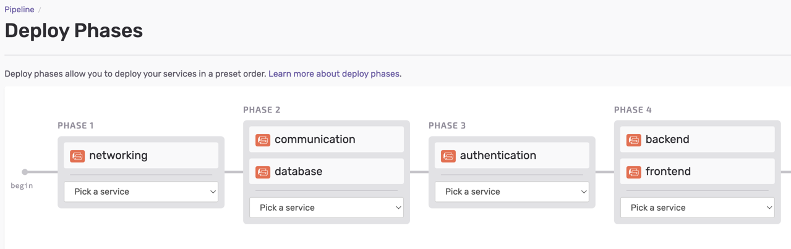

# Serverless AWS Project

This monorepo full-stack serverless application uses these frameworks and utilities:

- [sst](https://serverless-stack.com/): Making it easy to build full-stack serverless apps
- [aws-vault](https://github.com/99designs/aws-vault): securely store and access AWS credentials in a development environment
- [rush](https://rushjs.io/): a scalable monorepo manager for the web
- [pnpm](https://pnpm.io/): Fast, disk space efficient package manager
- [kysely](https://github.com/koskimas/kysely): A type-safe and autocompletion-friendly typescript SQL query builder
- [react](https://reactjs.org/): A JavaScript library for building user interfaces
- [mui](https://mui.com/): Comprehensive suite of UI tools for React
- [vite](https://vitejs.dev/): Next generation front end tooling

## Project Structure

- infrastructure/
    - [networking](infrastructure/networking/README.md): VPC, VPN and DNS Records
    - [database](infrastructure/database/README.md): Aurora Serverless Postgres Database Cluster and stage specific database
    - [communication](infrastructure/communication/README.md): SES Email
    - [authentication](infrastructure/authentication/README.md): Cognito
- apps/
    - backend: Database migration, Appsync API
    - frontend: Vite React Static Site


### Node Dependencies

We use [rush](https://rushjs.io/) and [pnpm](https://pnpm.io/) to manage our Node.js dependencies.
Packages are downloaded once and symlinked into each project's `node_modules` directory.
```bash
$ rush update
$ rush install
$ rush add -p missing-package
```

### Manual deployment and debugging with aws-vault

We use [aws-vault](https://github.com/99designs/aws-vault) to deploy and debug this serverless stack project.
You can deploy stages into different accounts, e.g.
```bash
$ aws-vault exec dev-account -- npx sst deploy --stage=dev
$ aws-vault exec qa-account -- npx sst deploy --stage=qa
$ aws-vault exec prod-account -- npx sst deploy --stage=production
```
and also create developer specific stacks in the same account.
```bash
$ aws-vault exec dev-account -- npx sst deploy --stage=barak # Developer specific stack
$ aws-vault exec dev-account -- npx sst deploy --stage=guy # Developer specific stack
```

Our [networking](infrastructure/networking/README.md) and
[database](infrastructure/database/README.md)
projects support re-using existing VPCs and database clusters when
cost-savings is a concern.


### Incremental Deployments with sed.run

We use [seed.run](https://seed.run) as our CI/CD engine. We take advantage of pnpm workspaces
to [incrementally deploy](https://seed.run/docs/incremental-service-deploys.html)
only those projects that have changes.

